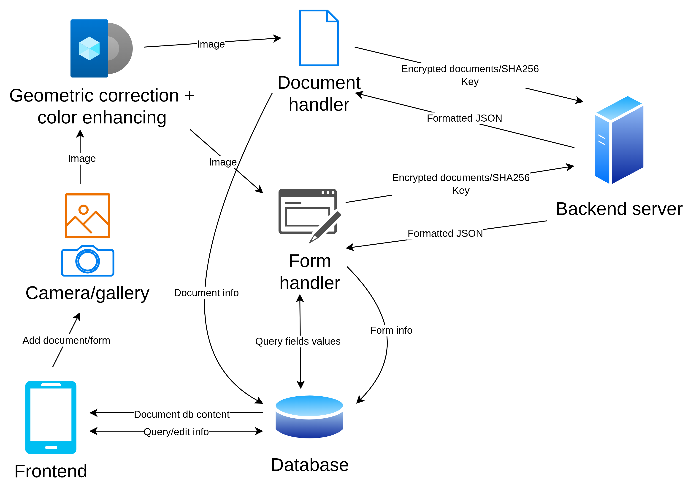
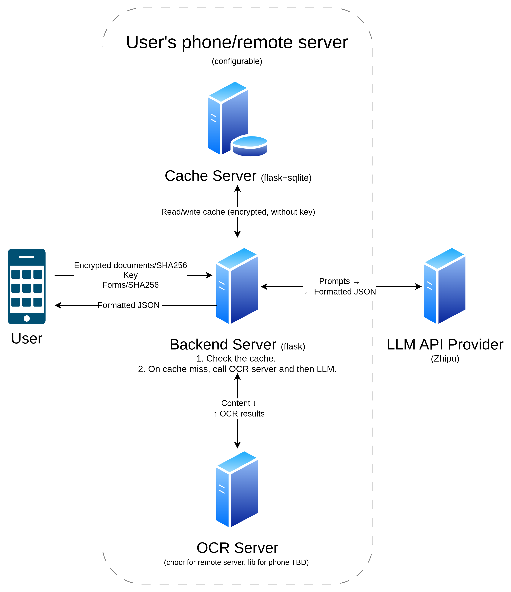

The `APIs and Controller -> Backend Server (Flask)` section is finalized, should be. 

The backend part swimlane diagram in the `Model and Engin -> Data and Control Flow Diagram` is also finalized. 

# Getting Started

This section outlines how to build and run the project, along with the **direct** third-party tools, libraries, SDKs, and APIs used.  

https://github.com/JI-DeepSleep/DocuSnap-Frontend

### **Front-End (Android)**  
Built with **Android Studio** targeting **Android 13 (API Level 33)**.  

#### **Dependencies**  
- **Encryption**:  
  - [Bouncy Castle](https://www.bouncycastle.org/) – Cryptographic algorithms.  
  - [Android Keystore System](https://developer.android.com/training/articles/keystore) – Secure key storage.  
- **Networking**:  
  - [OkHttp](https://square.github.io/okhttp/) – Underlying HTTP/2 support.  

### **Back-End (Flask)**  
Built with **Python**, using the following core dependencies:  

#### **Dependencies**  
- **Web Framework**:  
  - [Flask](https://flask.palletsprojects.com/) – Lightweight WSGI server.  
  - [Gunicorn](https://gunicorn.org/) – Production-grade WSGI HTTP server.  
- **Database**:  
  - [SQLite](https://www.sqlite.org/index.html) – Embedded relational database.  
- **OCR & AI Tools**:  
  - [CnOcr](https://github.com/breezedeus/cnocr) – Chinese and English OCR library.  
  - [Zhipu AI API](https://open.bigmodel.cn/) – Integration for generative AI tasks.  

### **Notes**  
- **Android Setup**: Ensure **Android SDK 33** is configured in Android Studio.  
- **Back-End Setup**: Use `pip install -r requirements.txt` 
- The frontend stack has not been finalized. The backend stack won't be far from this version, but we're considering adding support for edge processing (move everything except LLM to the phone) for better security and privacy.   

# Model and Engine

### Engine Components

1. User Frontend
   Handles UI interactions on the user's device.
2. Camera/Gallery
   Accesses device camera and photo storage.
3. Geo/Color Processor
   Performs image correction and enhancement.
4. Document/Form Handler
   Manages processing workflows and local data.
5. Frontend DB
   Stores processed documents/forms on device.
6. Backend Server
   Routes requests and manages tasks.
7. Backend Worker
   Executes asynchronous jobs.
8. Cache Server
   Temporary storage for processing results.
9. OCR Server
   Handles text extraction from images.
10. Zhipu LLM (External Service)
    Provides AI enrichment via API.

#### Component Integration

- Device components (1-5) use Android OS capabilities
- Backend services (6-9) run on our infrastructure
- Zhipu LLM (10) is an external dependency

### Data and Control Flow Diagram

We present the entity relationship in our app mainly through a swimlane diagram because we find it to be the most informative. Two block diagrams that best fit the assignment requirement but are less informative are also shown below. 

#### Swimlane Diagram

Below is the example flow of data and control if we want to parse a document A and a form B, and use the current document database to fill form B (fill task C). 

```mermaid
%%{init: {'theme': 'default', 'themeVariables': { 'primaryColor': '#f0f0f0'}}}%%
sequenceDiagram
    participant User as User Frontend<br>(User's Phone)
    participant CameraGallery as Camera/Gallery<br>(User's Phone)
    participant GeoColor as Geo/Color<br>(User's Phone)
    participant Handler as Document/Form Handler<br>(User's Phone)
    participant FEDB as Frontend DB<br>(User's Phone)
    participant Backend as Backend Server
    participant Worker as Backend Worker
    participant Cache as Cache Server
    participant OCR as OCR Server
    participant LLM as Zhipu LLM

    %% Document A Processing
    rect rgba(200,230,255,0.5)
        note over User: Document A (Camera)
        User->>CameraGallery: captureImage("camera")
        CameraGallery->>User: rawImage
        User->>GeoColor: correctGeometry(rawImage)
        GeoColor->>User: correctedImage
        User->>GeoColor: enhanceColors(correctedImage)
        GeoColor->>User: enhancedImage
        User->>Handler: processDocument(enhancedImage)
        Handler->>Backend: /api/process<br>(type=doc, SHA256_A, content=encrypted_payload)
        
        Backend->>Handler: 202 Accepted (processing)
        Backend->>Worker: Start processing thread
        
        par Polling and Processing
            loop Polling
                Handler->>Backend: /api/process<br>(type=doc, SHA256_A, has_content=false)
                Backend->>Cache: /api/cache/query<br>(client_id, SHA256_A, "doc")
                Cache->>Backend: 404 Not Found
                Backend->>Handler: 202 Accepted (processing)
            end
            
            Worker->>OCR: /api/ocr/extract
            OCR->>Worker: text
            Worker->>LLM: /api/llm/enrich
            LLM->>Worker: formatted_json
            Worker->>Cache: /api/cache/store<br>(client_id, SHA256_A, "doc", data)
            Cache->>Worker: 201 Created
        end
        
        Handler->>Backend: /api/process<br>(type=doc, SHA256_A, has_content=false)
        Backend->>Cache: /api/cache/query<br>(client_id, SHA256_A, "doc")
        Cache->>Backend: 200 OK (data)
        Backend->>Handler: 200 OK (result)
        Handler->>FEDB: saveDocument(sha256_A, metadata)
        Handler->>Backend: /api/clear<br>(client_id, SHA256_A)
        Backend->>Cache: /api/cache/clear<br>(client_id, SHA256_A, "doc")
        Cache->>Backend: 200 OK (cleared:1)
        Backend->>Handler: 200 OK (cleared:1)
        Handler->>User: processComplete
    end


    %% Form B Processing
    rect rgba(230,255,230,0.5)
        note over User: Form B (Gallery)
        User->>CameraGallery: captureImage("gallery")
        CameraGallery->>User: rawImage
        User->>GeoColor: correctGeometry(rawImage)
        GeoColor->>User: correctedImage
        User->>GeoColor: enhanceColors(correctedImage)
        GeoColor->>User: enhancedImage
        User->>Handler: processForm(enhancedImage, "formB")
        Handler->>Backend: /api/process<br>(type=form, SHA256_B, content=encrypted_payload)
        
        Backend->>Handler: 202 Accepted (processing)
        Backend->>Worker: Start processing thread
        
        par Polling and Processing
            loop Polling
                Handler->>Backend: /api/process<br>(type=form, SHA256_B, has_content=false)
                Backend->>Cache: /api/cache/query<br>(client_id, SHA256_B, "form")
                Cache->>Backend: 404 Not Found
                Backend->>Handler: 202 Accepted (processing)
            end
            
            Worker->>OCR: /api/ocr/extract
            OCR->>Worker: text
            Worker->>LLM: /api/llm/enrich
            LLM->>Worker: formatted_json
            Worker->>Cache: /api/cache/store<br>(client_id, SHA256_B, "form", data)
            Cache->>Worker: 201 Created
        end
        
        Handler->>Backend: /api/process<br>(type=form, SHA256_B, has_content=false)
        Backend->>Cache: /api/cache/query<br>(client_id, SHA256_B, "form")
        Cache->>Backend: 200 OK (data)
        Backend->>Handler: 200 OK (result)
        Handler->>FEDB: saveFormData("formB", data)
        Handler->>Backend: /api/clear<br>(client_id, SHA256_B)
        Backend->>Cache: /api/cache/clear<br>(client_id, SHA256_B, "form")
        Cache->>Backend: 200 OK (cleared:1)
        Backend->>Handler: 200 OK (cleared:1)
        Handler->>User: processComplete
    end

    %% Fill Task C
    rect rgba(255,230,200,0.5)
        note over User: Fill Task C
        User->>Handler:fillForm("formB")
        Handler->>Backend: /api/process<br>(type=fill, content=encrypted_payload)
        
        Backend->>Handler: 202 Accepted (processing)
        Backend->>Worker: Start processing thread
        
        par Polling and Processing
            loop Polling
                Handler->>Backend: /api/process<br>(type=fill, has_content=false)
                Backend->>Cache: /api/cache/query<br>(client_id, "composite_sha", "fill")
                Cache->>Backend: 404 Not Found
                Backend->>Handler: 202 Accepted (processing)
            end
            
            Worker->>LLM: /api/llm/enrich
            LLM->>Worker: filled_form
            Worker->>Cache: /api/cache/store<br>(client_id, "composite_sha", "fill", data)
            Cache->>Worker: 201 Created
        end
        
        Handler->>Backend: /api/process<br>(type=fill, has_content=false)
        Backend->>Cache: /api/cache/query<br>(client_id, "composite_sha", "fill")
        Cache->>Backend: 200 OK (data)
        Backend->>Handler: 200 OK (result)
        Handler->>FEDB: updateDocumentData(sha256_A, updates)
        Handler->>Backend: /api/clear<br>(client_id, "composite_sha")
        Backend->>Cache: /api/cache/clear<br>(client_id, "composite_sha", "fill")
        Cache->>Backend: 200 OK (cleared:1)
        Backend->>Handler: 200 OK (cleared:1)
        Handler->>User: processComplete
    end
```



#### Block Diagrams





### Component Implementation

1. User Frontend
   - Functionality: UI rendering and interaction
   - Implementation: Android Studio (API 33); Build from scratch
2. Camera/Gallery
   - Functionality: Image capture/selection
   - Implementation: Android Studio (API 33) and Gallery APIs
3. Geo/Color Processor
   - Functionality: Image correction/enhancement
   - Implementation: Android Studio (API 33); Build from scratch
4. Document/Form Handler
   - Functionality: Workflow coordination
   - Implementation: Android Studio (API 33); Build from scratch
5. Frontend DB
   - Functionality: Local data persistence
   - Implementation: SQLite via Android Room
6. Backend Server
   - Functionality: API routing
   - Implementation: Flask + Gunicorn
7. Backend Worker
   - Functionality: Async processing
   - Implementation: Python threading
8. Cache Server
   - Functionality: Temporary data storage
   - Implementation: Flask + Gunicorn + SQLite
9. OCR Server
   - Functionality: Text extraction
   - Implementation: Flask + Gunicorn + CnOcr library
10. Zhipu LLM (External Service)
    - Functionality: Data enrichment
    - Implementation: External API integration

# APIs and Controller

### Frontend Modules (Function Calls)
Internal frontend APIs via function calls.

#### Camera/Gallery Module
```typescript
function captureImage(source: "camera" | "gallery"): Image
```
- Captures/selects image from device camera or gallery
- Returns raw image object

#### Geometric Correction
```typescript
function correctGeometry(image: Image): Image
```
- Applies perspective correction and deskewing
- Returns geometrically corrected image

#### Color Enhancement
```typescript
function enhanceColors(image: Image): Image
```
- Optimizes contrast, brightness and color balance
- Returns color-enhanced image

#### Document Handler
```typescript
function processDocument(enhancedImage: Image): { encryptedDoc: string, sha256: string }
```
- Processes generic documents
- Returns RSA-encrypted document and SHA256 hash

#### Form Handler
```typescript
function processForm(enhancedImage: Image, formType: string): { encryptedDoc: string, sha256: string }
function fillForm(formId: string): JSON
```
`processForm`:

- Processes structured forms using DB templates
- Returns encrypted document and SHA256 hash

`fillForm`:

- Fill the given form

#### Frontend Database
```typescript
// Document storage
function saveDocument(sha256: string, metadata: JSON): boolean
function getDocument(sha256: string): Document
function updateDocumentData(sha256: string, updates: JSON): boolean

// Form data storage
function saveFormData(formId: string, data: JSON): boolean
function getFormData(formId: string): JSON
```

Here's the revised API documentation with unified SHA256 naming, enhanced descriptions, examples, and consistent formatting:

Based on your requirements, I've updated the documentation with the new result structures and renamed `doc_lib` to `file_lib`. Here's the revised documentation:

### Backend Server (Flask)
Main entry point for processing requests and status checks.

#### Unified Processing Endpoint: `/api/process`
Handles all document processing types (doc/form/fill) through a single interface.  
**Request Body (JSON)**:

| Key           | Type                                    | Required | Description                                                  |
| ------------- | --------------------------------------- | -------- | ------------------------------------------------------------ |
| `client_id`   | String (UUID)                           | Yes      | Client identifier                                            |
| `type`        | String                                  | Yes      | Processing type: `"doc"`, `"form"`, or `"fill"`              |
| `SHA256`      | String                                  | Yes      | SHA256 hash computed as per rules below                      |
| `has_content` | Boolean                                 | Yes      | Indicates whether content payload is included                |
| `content`     | String(AES(base64(actual json string))) | No       | Required when `has_content=true` - AES(base64(actual json string)) |
| `aes_key`     | String(RSA(real_aes_key))               | No       | Required when `has_content=true` - RSA(real_aes_key)         |

**SHA256 Computation**:

```python
SHA256( content_string )
```

**Content Payload Structure** (After 1. AES decryption and then 2. base64 decryption):

```json
{
  "to_process": ["base64_img1", "base64_img2"],  // For doc/form
  "to_process": form_obj,              // For fill
  "file_lib": {  // Renamed from doc_lib
    "docs": [doc_obj_1, doc_obj_2, ...],
    "forms": [form_obj_1, form_obj_2, ...]
  }
}
```

**Validation**:
1. `has_content=true` requires `content` field (else `400`)
2. Computed SHA256 must match provided `SHA256` (else `400`)
3. Backend decrypts `aes_key` using private RSA key to get the real aes key.
4. Backend decrypts `content` using real aes key and then base64 decryption.

**Response**:

```json
{
  "status": "processing|completed|error",
  "error_detail": "Description",  // Only for error status
  "result": "base64(AES(actual json string))"    // Only for completed status, the content is 
}
```

**Result Structures (after decryption)**:

```json
// Doc type
{
  "title": "a few words",
  "tags": ["array", "of", "words"],
  "description": "a few sentences",
  "kv": {
    "key1": "value1",
    "key2": "value2"  // Extracted key-value pairs
  },
  "related": [
    {"type": "xxx", "resource_id": "xxx"}  // array of related docs
  ]
}

// Form type
{
  "title": "a few words",
  "tags": ["array", "of", "words"],
  "description": "a few sentences",
  "kv": {
    "key1": "value1",
    "key2": "value2"  // Extracted key-value pairs
  },
  "fields": ["field1", "field2"],
  "related": [
    {"type": "xxx", "resource_id": "xxx"}  // array of related docs
  ]
}

// Fill type
{
  "field1": {
    "value": "value1",
    "source": {"type": "xxx", "resource_id": "xxx"}  // array of related docs
  },
  "field2": {
    "value": "value2",
    "source": {"type": "xxx", "resource_id": "xxx"}
  }
}
```

**Status Codes**:

| Code | Description                                         |
| ---- | --------------------------------------------------- |
| 200  | Result available (`status=completed`)               |
| 202  | Processing in progress (`status=processing`)        |
| 400  | Invalid input/SHA256 mismatch/SHA256 not recognized |
| 500  | Internal server error                               |

**Example Request**:
```json
{
  "client_id": "550e8400-e29b-41d4-a716-446655440000",
  "type": "doc",
  "SHA256": "9f86d081...b4b9a5",
  "has_content": true,
  "aes_key": "rsa encrypted"
  "content": "base64(AES(actual json string))"
}
```

**Example Response**:

```json
{
  "status": "completed",
  "result": {    //  Decrypted
    "title": "Lease Agreement",
    "tags": ["legal", "contract"],
    "description": "Standard residential lease agreement for 12 months",
    "kv": {
      "landlord": "Jane Smith",
      "tenant": "John Doe",
      "term": "12 months"
    },
    "related": [
      {"type": "form", "resource_id": "that form's uuid"}
    ]
  }
}
```

---
#### Endpoint: `/api/clear`
Clears processing results from the system.  
**Request Body (JSON)**:

| Key         | Type          | Required | Description                                     |
| ----------- | ------------- | -------- | ----------------------------------------------- |
| `client_id` | String (UUID) | Yes      | Client identifier                               |
| `type`      | String        | No       | Processing type: `"doc"`, `"form"`, or `"fill"` |
| `SHA256`    | String        | No       | Specific document hash to clear                 |

**Response**:
```json
{
  "status": "ok"
}
```

**Status Codes**:

| Code | Description              |
| ---- | ------------------------ |
| 200  | Clearance successful     |
| 400  | Missing client_id        |
| 500  | Internal clearance error |

---
### Cache Server (Flask+SQLite)
Stores and retrieves encrypted processing results using composite keys `(client_id, SHA256, type)`.

#### Endpoint: `/api/cache/query`
Retrieves cached processing results.  
**Query Parameters**:
| Key         | Type          | Required | Description              |
| ----------- | ------------- | -------- | ------------------------ |
| `client_id` | String (UUID) | Yes      | Client identifier        |
| `SHA256`    | String        | Yes      | Document hash            |
| `type`      | String        | Yes      | `doc`, `form`, or `fill` |

**Response**:

```json
// Success (200)
{"data": "ENCRYPTED_RESULT_STRING"}
// Not found (404)
{"error": "Cache entry missing"}
```

---
#### Endpoint: `/api/cache/store`
Stores processing results in cache.  
**Request Body (JSON)**:

| Key         | Type          | Required | Description                                     |
| ----------- | ------------- | -------- | ----------------------------------------------- |
| `client_id` | String (UUID) | Yes      | Client identifier                               |
| `type`      | String        | Yes      | Processing type: `"doc"`, `"form"`, or `"fill"` |
| `SHA256`    | String        | Yes      | Document hash                                   |
| `data`      | String        | Yes      | Encrypted result data                           |

**Response**: `201 Created` (Empty body)

---
#### Endpoint: `/api/cache/clear`
Clears cached entries.  
**Request Body (JSON)**:

| Key         | Type          | Required | Description                                     |
| ----------- | ------------- | -------- | ----------------------------------------------- |
| `client_id` | String (UUID) | Yes      | Client identifier                               |
| `type`      | String        | No       | Processing type: `"doc"`, `"form"`, or `"fill"` |
| `SHA256`    | String        | No       | Specific document hash to clear                 |

**Response**:
```json
{
  "status": "ok"
}
```

---
### OCR Server (CnOCR)
Performs text extraction from images.  
#### Endpoint: `/api/ocr/extract`
**Request Body (JSON)**:
| Key          | Type            | Required | Description     |
| ------------ | --------------- | -------- | --------------- |
| `image_data` | String (Base64) | Yes      | Decrypted image |

**Response**:
```json
{
  "text": "Extracted document text..."
}
```
**Status Code**: `200 OK`

## Third-Party SDKs

### 1. LLM API Provider (Zhipu)
Format OCR data using LLM.
- **API Documentation**:
[GLM-4](https://bigmodel.cn/dev/api/normal-model/glm-4)
[GLM-Z1](https://bigmodel.cn/dev/api/Reasoning-models/glm-z1)

### 2. CnOCR

Chinese/English OCR tool for text recognition. 

- **API Documentation:**

  [CnOCR](https://github.com/breezedeus/CnOCR/blob/master/README_en.md)

# View UI/UX

# 👥 Team Roster

This project is built by a collaborative team of five, each contributing unique expertise across image processing, machine learning, UI/UX, and backend infrastructure. Below is a list of our team members and roles:

| Name           | JAccount         | Task Assignment                                      | Key Strengths                                      | Sub-team                  |
|----------------|------------------|------------------------------------------------------|----------------------------------------------------|---------------------------|
| **Zijun Yang** | zijunyang        | PM, OCR, LLM Integration                             | Web, Server Maintenance, Backend Dev, OS, Networks, Scheduling System | Post Processing Sub-team  |
| **Jingjia Peng** | shigarmouny     | OCR, LLM, UI                                         | AI Agent Development, UI/UX Design                 | Shared Across Both Teams  |
| **Ziming Zhou** | zimingzhou_03   | Geometric Correction, Image Enhancement              | ML Systems, Operating Systems, Distributed Systems | Image Processing Sub-team |
| **Minyang Qu**  | 2424922674      | Data Pipeline Development                            | Data Science, SQL                                  | Post Processing Sub-team  |
| **Huijie Tang** | tanghuijie      | ML-based Enhancement and Preprocessing               | Machine Learning                                   | Image Processing Sub-team |

> 🔍 *At the end of term, we'll update this section with detailed contributions. If this GitHub repo is made public, visitors (and potential employers) will see our individual impact on the project clearly.*
