# Getting Started

This section outlines how to build and run the project, along with the **direct** third-party tools, libraries, SDKs, and APIs used.  

### **Front-End (Android)**  
Built with **Android Studio** targeting **Android 13 (API Level 33)**.  

#### **Dependencies**  
- **Encryption**:  
  - [Bouncy Castle](https://www.bouncycastle.org/) – Cryptographic algorithms.  
  - [Android Keystore System](https://developer.android.com/training/articles/keystore) – Secure key storage.  
- **Networking**:  
  - [OkHttp](https://square.github.io/okhttp/) – Underlying HTTP/2 support.  

### **Back-End (Flask)**  
Built with **Python**, using the following core dependencies:  

#### **Dependencies**  
- **Web Framework**:  
  - [Flask](https://flask.palletsprojects.com/) – Lightweight WSGI server.  
  - [Gunicorn](https://gunicorn.org/) – Production-grade WSGI HTTP server.  
- **Database**:  
  - [SQLite](https://www.sqlite.org/index.html) – Embedded relational database.  
- **OCR & AI Tools**:  
  - [CnOcr](https://github.com/breezedeus/cnocr) – Chinese and English OCR library.  
  - [Zhipu AI API](https://open.bigmodel.cn/) – Integration for generative AI tasks.  

### **Notes**  
- **Android Setup**: Ensure **Android SDK 33** is configured in Android Studio.  
- **Back-End Setup**: Use `pip install -r requirements.txt` .  

# Model and Engine

#### Swimlane Diagram

```mermaid
%%{init: {'theme': 'default', 'themeVariables': { 'primaryColor': '#f0f0f0'}}}%%
sequenceDiagram
    participant User as User Frontend<br>(User's Phone)
    participant CameraGallery as Camera/Gallery<br>(User's Phone)
    participant GeoColor as Geo/Color<br>(User's Phone)
    participant Handler as Document/Form Handler<br>(User's Phone)
    participant FEDB as Frontend DB<br>(User's Phone)
    participant Backend as Backend Server
    participant Worker as Backend Worker
    participant Cache as Cache Server
    participant OCR as OCR Server
    participant LLM as Zhipu LLM

    %% Document A Processing
    rect rgba(200,230,255,0.5)
        note over User: Document A (Camera)
        User->>CameraGallery: captureImage("camera")
        CameraGallery->>User: rawImage
        User->>GeoColor: correctGeometry(rawImage)
        GeoColor->>User: correctedImage
        User->>GeoColor: enhanceColors(correctedImage)
        GeoColor->>User: enhancedImage
        User->>Handler: processDocument(enhancedImage)
        Handler->>User: encryptedDoc_A, sha256_A
        User->>Backend: /api/process_document<br>(sha256_A, image, client_id)
        
        Backend->>User: 202 Accepted (processing)
        Backend->>Worker: Start processing thread
        
        par Polling and Processing
            loop Polling
                User->>Backend: /api/process_document<br>(sha256_A, client_id)
                Backend->>Cache: /api/cache/query<br>(client_id, sha256_A, "document")
                Cache->>Backend: 404 Not Found
                Backend->>User: 202 Accepted (processing)
            end
            
            Worker->>OCR: /api/ocr/extract
            OCR->>Worker: text
            Worker->>LLM: /api/llm/enrich
            LLM->>Worker: formatted_json
            Worker->>Cache: /api/cache/store<br>(client_id, sha256_A, "document")
            Cache->>Worker: 201 Created
        end
        
        User->>Backend: /api/process_document<br>(sha256_A, client_id)
        Backend->>Cache: /api/cache/query<br>(client_id, sha256_A, "document")
        Cache->>Backend: 200 OK (data)
        Backend->>User: 200 OK (result)
        User->>FEDB: saveDocument(sha256_A, metadata)
        User->>Backend: /api/clear<br>(client_id, sha256_A)
        Backend->>Cache: /api/cache/clear<br>(client_id, sha256_A, "document")
    end

    %% Form B Processing
    rect rgba(230,255,230,0.5)
        note over User: Form B (Gallery)
        User->>CameraGallery: captureImage("gallery")
        CameraGallery->>User: rawImage
        User->>GeoColor: correctGeometry(rawImage)
        GeoColor->>User: correctedImage
        User->>GeoColor: enhanceColors(correctedImage)
        GeoColor->>User: enhancedImage
        User->>Handler: processForm(enhancedImage, "formB")
        Handler->>User: encryptedDoc_B, sha256_B
        User->>Backend: /api/process_form<br>(sha256_B, image, client_id)
        
        Backend->>User: 202 Accepted (processing)
        Backend->>Worker: Start processing thread
        
        par Polling and Processing
            loop Polling
                User->>Backend: /api/process_form<br>(sha256_B, client_id)
                Backend->>Cache: /api/cache/query<br>(client_id, sha256_B, "form")
                Cache->>Backend: 404 Not Found
                Backend->>User: 202 Accepted (processing)
            end
            
            Worker->>OCR: /api/ocr/extract
            OCR->>Worker: text
            Worker->>LLM: /api/llm/enrich
            LLM->>Worker: formatted_json
            Worker->>Cache: /api/cache/store<br>(client_id, sha256_B, "form")
            Cache->>Worker: 201 Created
        end
        
        User->>Backend: /api/process_form<br>(sha256_B, client_id)
        Backend->>Cache: /api/cache/query<br>(client_id, sha256_B, "form")
        Cache->>Backend: 200 OK (data)
        Backend->>User: 200 OK (result)
        User->>FEDB: saveFormData("formB", data)
        User->>Backend: /api/clear<br>(client_id, sha256_B)
        Backend->>Cache: /api/cache/clear<br>(client_id, sha256_B, "form")
    end

    %% Fill Task C
    rect rgba(255,230,200,0.5)
        note over User: Fill Task C
        User->>Backend: /api/process_fill<br>(client_id, document_data, form_data)
        
        Backend->>User: 202 Accepted (processing)
        Backend->>Worker: Start processing thread
        
        par Polling and Processing
            loop Polling
                User->>Backend: /api/process_fill<br>(client_id)
                Backend->>Cache: /api/cache/query<br>(client_id, "fillC", "fill")
                Cache->>Backend: 404 Not Found
                Backend->>User: 202 Accepted (processing)
            end
            
            Worker->>LLM: /api/llm/enrich
            LLM->>Worker: filled_form
            Worker->>Cache: /api/cache/store<br>(client_id, "fillC", "fill")
            Cache->>Worker: 201 Created
        end
        
        User->>Backend: /api/process_fill<br>(client_id)
        Backend->>Cache: /api/cache/query<br>(client_id, "fillC", "fill")
        Cache->>Backend: 200 OK (data)
        Backend->>User: 200 OK (result)
        User->>FEDB: updateDocumentData(sha256_A, updates)
        User->>Backend: /api/clear<br>(client_id, "fillC")
        Backend->>Cache: /api/cache/clear<br>(client_id, "fillC", "fill")
    end
```



# APIs and Controller

### 1. Frontend Modules (Function Calls)
Internal frontend APIs via function calls.

#### Camera/Gallery Module
```typescript
function captureImage(source: "camera" | "gallery"): Image
```
- Captures/selects image from device camera or gallery
- Returns raw image object

#### Geometric Correction
```typescript
function correctGeometry(image: Image): Image
```
- Applies perspective correction and deskewing
- Returns geometrically corrected image

#### Color Enhancement
```typescript
function enhanceColors(image: Image): Image
```
- Optimizes contrast, brightness and color balance
- Returns color-enhanced image

#### Document Handler
```typescript
function processDocument(enhancedImage: Image): { encryptedDoc: string, sha256: string }
```
- Processes generic documents
- Returns RSA-encrypted document and SHA256 hash

#### Form Handler
```typescript
function processForm(enhancedImage: Image, formType: string): { encryptedDoc: string, sha256: string }
```
- Processes structured forms using DB templates
- Returns encrypted document and SHA256 hash

#### Frontend Database
```typescript
// Document storage
function saveDocument(sha256: string, metadata: JSON): boolean
function getDocument(sha256: string): Document
function updateDocumentData(sha256: string, updates: JSON): boolean

// Form data storage
function saveFormData(formId: string, data: JSON): boolean
function getFormData(formId: string): JSON
```

### 2. Backend Server (Flask)
Main entry point for processing requests and status checks.

#### Endpoint: `/api/process_document`
| **Request Parameters** | | ||
| ---------------------- | ----------- | ----------------- | -------------------------------------------- |
| `client_id`| Body (JSON) | `String` (UUID) | **Required** Client identifier |
| `sha256_key` | Body (JSON) | `String`| **Required** SHA256 hash of the document |
| `image`| Body (JSON) | `String` (Base64) | **Optional** RSA-encrypted image data|
| `encryption_key` | Body (JSON) | `String`| **Optional** User encryption key for results |

**Validation Rules**:
- If `image` is provided:
1. `encryption_key` must be present (else `400`)
2. Backend decrypts image using its private RSA key
3. SHA256 of decrypted image must match `sha256_key` (else `400`)

| **Response Codes** | |
| ------------------ | ------------------------- |
| `200 OK` | Result available|
| `202 Accepted` | Processing in progress|
| `400 Bad Request`| Invalid input/missing key |
| `404 Not Found`| SHA256 not recognized |
| `500 Server Error` | Internal processing error |

**Returns** (Case 1: Result Available):
| **Key**| **Type** | **Description** |
| -------- | -------- | ------------------------- |
| `status` | `String` | `"complete"`|
| `result` | `String` | Encrypted with user's key |

**Returns** (Case 2: Processing In Progress):
| **Key**| **Type** | **Description** |
| -------- | -------- | --------------- |
| `status` | `String` | `"processing"`|

**Returns** (Case 3: Error State):
| **Key**| **Type** | **Description**|
| -------- | -------- | -------------------------------------------------- |
| `status` | `String` | `"error_processing"` or `"error_sha256_not_found"` |
| `detail` | `String` | Error description|

#### Endpoint: `/api/clear`
| **Request Parameters** | | | |
| ---------------------- | ----------- | --------------- | --------------------------------------- |
| `client_id`| Body (JSON) | `String` (UUID) | **Required** Client identifier|
| `sha256_key` | Body (JSON) | `String`| **Optional** Specific document to clear |

| **Response Codes** ||
| ------------------ | -------------------- |
| `200 OK` | Clearance successful |
| `400 Bad Request`| Missing client_id|
| `500 Server Error` | Clearance failed |

**Returns**:
| **Key** | **Type**| **Description** |
| --------- | --------- | --------------------------------------- |
| `cleared` | `Integer` | Number of entries cleared |
| `status`| `String`| `"all_cleared"` or `"specific_cleared"` |

#### Endpoint: `/api/process_form`

The API interface is almost the same as `/api/process_document`, except that it is used for form parsing. 

The differences are:

- The results are not an array of key-value pairs, but an array of name of the fields that need to be filled. 

#### Endpoint: `/api/process_fill`

The API interface is almost the same as `/api/process_document`, except that it is used for filling a form given a document db. 

The differences are:

- The input argument `image` is replaced with two encrypted JSON object: `document_data` and `form_data`, which are JSON objects after decryption. 
- The results are an array of key-value pairs, with key being fields to be filled in `form_data` and value being either information found in `document_data` or null if cannot be determined. 

### 3. Cache Server(Flask+SQLite)

Stores encrypted processing results. Uses composite keys: `(client_id, sha256_key)`.

#### Endpoint: `/api/cache/query`
| **Request Parameters** | | ||
| ---------------------- | ----------- | --------------- | -------------------------- |
| `client_id`| Query Param | `String` (UUID) | Client identifier|
| `sha256_key` | Query Param | `String`| SHA256 key of the document |
| `type` | Query Param | `String` (document/form/fill) |  |

| **Response Codes** | |
| ------------------ | ------------------- |
| `200 OK` | Cache entry found |
| `404 Not Found`| Cache entry missing |

**Returns** (Success):
| **Key** | **Type** | **Description**|
| ------- | -------- | ---------------- |
| `data`| `String` | Encrypted result |

#### Endpoint: `/api/cache/store`
| **Request Parameters** | | ||
| ---------------------- | ----------- | --------------- | -------------------------- |
| `client_id`| Body (JSON) | `String` (UUID) | Client identifier|
| `sha256_key` | Body (JSON) | `String`| SHA256 key of the document |
| `type` | Query Param | `String` (document/form/fill) |  |
| `data` | Body (JSON) | `String`| Encrypted result to store|

| **Response Codes** ||
| ------------------ | ------------------ |
| `201 Created`| Cache entry stored |

**Returns**: Empty body

#### Endpoint: `/api/cache/clear`
| **Request Parameters** | | | |
| ---------------------- | ----------- | --------------- | --------------------------------------- |
| `client_id`| Body (JSON) | `String` (UUID) | **Required** Client identifier|
| `sha256_key` | Body (JSON) | `String`| **Optional** Specific document to clear |
| `type` | Query Param | `String` (document/form/fill) |  |

| **Response Codes** ||
| ------------------ | -------------------- |
| `200 OK` | Clearance successful |

**Returns**:
| **Key** | **Type**| **Description** |
| --------- | --------- | ------------------------- |
| `cleared` | `Integer` | Number of entries cleared |

### 4. OCR Server(CnOCR)
Performs text extraction.

#### Endpoint: `/api/ocr/extract`
| **Request Parameters** | | ||
| ---------------------- | ----------- | ----------------- | ---------------------------- |
| `image_data` | Body (JSON) | `String` (Base64) | Decrypted image from backend |

| **Response Codes** ||
| ------------------ | -------------- |
| `200 OK` | Text extracted |

**Returns**:
| **Key** | **Type** | **Description**|
| ------- | -------- | ------------------ |
| `text`| `String` | Extracted raw text |

## Third-Party SDKs

### 1. LLM API Provider (Zhipu)
Format OCR data using LLM.
- **API Documentation**:
[GLM-4](https://bigmodel.cn/dev/api/normal-model/glm-4)
[GLM-Z1](https://bigmodel.cn/dev/api/Reasoning-models/glm-z1)

### 2. CnOCR

Chinese/English OCR tool for text recognition. 

- **API Documentation:**

  [CnOCR](https://github.com/breezedeus/CnOCR/blob/master/README_en.md)

# View UI/UX

# Team Roster